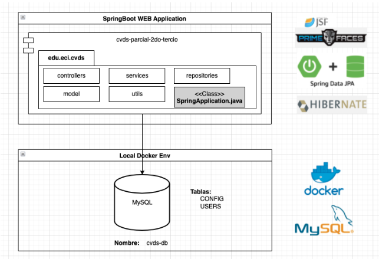
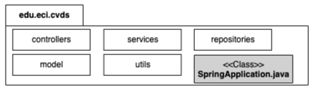

# PARCIAL 2DO TERCIO - CVDS - PROYECTO PLANTILLA
## DIAGRAMA DE ARQUITECRURA:

Crear un nuevo repositorio llamado cvds-parcial-2do-tercio en la cuenta personal de Azure DevOps que cuente con la siguiente arquitectura:

## DIAGRAMA DE PAQUETES:

El proyecto deberá seguir la siguiente estructura de paquetes:

- controllers: Paquete contenedor las clases como backing beans para soportar las páginas de JSF.
- services: Paquete contenedor las clases que contienen la lógica de negocio.
- repositories: Paquete contenedor las clases que se comunican con fuentes de datos, 
- model: Paquete contenedor las clases planas (POJOs, Entity) en donde se modelan los objetos del propios del negocio.
- utils: Paquete contenedor de las clases utilitarias que prestan un servicio a las demás capas del proyecto. (Formatters, Mappers, Helpers)

## CALIDAD DE CÓDIGO:
Instar en el IDE de desarrollo la herramienta SonarLint, la cual provee la utilidad de analisis estático de código. Descargar acá

Con esta herramienta depurar el código según las diferentes sugerencias que esta reporte.
Hacer 1 commit aplicando los ajustes que esta herramienta sugiera.

## FUNCIONALIDAD:
El proyecto deberá tener una página de login, donde pida usuario y contraseña.
El usuario y contraseña deberá estar almacenado en una tabla llamada USERS en la base de datos.
El sistema deberá realizar la correspondiente validación, en caso de ser exitosa, le debe dar ingreso a otra página llamada guess.xhtml.
El proyecto deberá tener otra página luego del login
En esta página la idea es que el se pueda evidenciar el uso de varias etiquetas de primefaces.
En una sección de esta página mostrar una tabla con todos los usuarios registrados en la base de datos.
IMPORTANTE: Como se pueden dar cuenta si lograron realizar el laboratorio 9, ese mismo proyecto lo podrían usar para que satisfaga este punto. Solamente que es necesario ajustar el nombre del proyecto, los nombres de los paquetes y agregar un poco de calidad de código.
Sino, puedes usar este proyecto plantilla: Proyecto plantilla
Se debe entregar la URL vía correo electrónico a ivan.lemus@escuelaing.edu.co

Well done!
NOTA: Si terminas, puedes ayudar a otros, solo con tu voz, el propósito es enseñar. No se permitirá enviar nada por medios electrónicos.